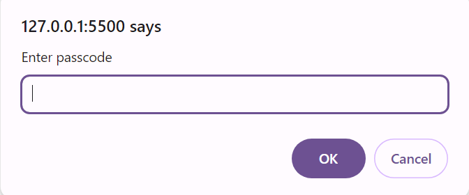

# JavaScript Functions Overview 🚀

Functions are essential in JavaScript, allowing us to encapsulate reusable pieces of code. This guide introduces JavaScript functions, covering how to invoke them, use `console.log`, and work with return values. Let’s dive into this powerful feature of JavaScript! 🧑‍💻

## 📖 Table of Contents
1. [What are Functions? 🤔](#what-are-functions-)
2. [Invoking Functions 🏃‍♂️](#invoking-functions-)
3. [Using `console.log` 🖥️](#using-consolelog-)
4. [Return Values 🎁](#return-values-)

### 1. What are Functions? 🤔

A **function** in JavaScript is a block of code wrapped in a value that can be executed whenever it’s called. Many values in the JavaScript environment are of the function type, such as `prompt` and `console.log`.

For example, in a browser, the `prompt` function shows a dialog box asking for user input:

```javascript
prompt("Enter passcode");
```



### 2. Invoking Functions 🏃‍♂️

To **invoke** or **call** a function, you place parentheses `()` after the function name. Inside the parentheses, you can pass **arguments** — values used by the function.

#### Example of Calling a Function with an Argument

```javascript
prompt("Enter passcode"); // Calls prompt with the message "Enter passcode"
```

📌 **Note**: Each function may require a specific number and type of arguments.

### 3. Using `console.log` 🖥️

The `console.log` function outputs values to the JavaScript console, available in all browsers and in Node.js. This is useful for displaying information, debugging, and observing program behavior.

To open the **JavaScript Console**:
- Press **F12** on Windows.
- Press **command-option-I** on a Mac.

#### Example of `console.log`

```javascript
console.log("Hello, world!"); // Outputs "Hello, world!" to the console
```

🧠 **Did You Know?** `console.log` isn’t a simple binding but a **property** of `console`, which is why we write `console.log` with a dot notation.

### 4. Return Values 🎁

Some functions **return values** when called. This means they produce a result without needing to create a visible side effect.

#### Examples of Return Values

- `Math.max` returns the largest number among the arguments given:
  ```javascript
  console.log(Math.max(2, 4)); // → 4
  ```
- `Math.min` can also be used within larger expressions, as shown here:
  ```javascript
  console.log(Math.min(2, 4) + 100); // → 102
  ```

🎯 **Takeaway**: Functions that return values are extremely useful as they allow us to build complex expressions by combining results from multiple functions.

🧩 **In Summary**:
- **Functions** are reusable code blocks that can be invoked.
- **Arguments** provide input to functions.
- **Return values** enable functions to output data without visible effects.
