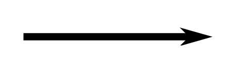
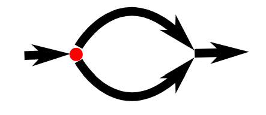
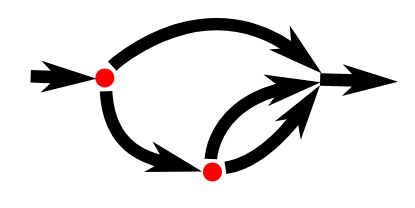

# Control Flow in JavaScript 🚦

Mastering **control flow** in JavaScript allows you to control the sequence in which statements are executed, adding dynamism and responsiveness to your code. With control flow structures like `if`, `else`, and `else if`, you can create code that adapts to different scenarios, improving readability and functionality.

## 📖 Table of Contents
1. [Sequential Execution 📜](#sequential-execution-)
2. [Conversion Functions 🔄](#conversion-functions-)
3. [Schematic Representation 📊](#schematic-representation-)
4. [Conditional Execution 🔀](#conditional-execution-)
5. [Using Braces 🧱](#using-braces-)
6. [Else Keyword ➕](#else-keyword-)
7. [Chaining Conditional Execution 🔗](#chaining-conditional-execution-)
8. [Summary 🧩](#summary-)


### Sequential Execution 📜

In JavaScript, statements are executed sequentially by default. Each line runs in order from top to bottom, forming a straightforward flow. Sequential execution is foundational, as each statement builds upon the results of the previous ones.

#### Example

```javascript
let theNumber = Number(prompt("Pick a number"));
console.log("Your number is the square root of " + theNumber * theNumber);
```

**Explanation:**
1. **First Statement:**  
   ```javascript
   let theNumber = Number(prompt("Pick a number"));
   ```
   - **Input Prompt**: Prompts the user to enter a number via `prompt`.
   - **String Conversion**: The `prompt` function returns the input as a string.
   - **Numeric Conversion**: `Number` converts this string to a number and assigns it to `theNumber`.

2. **Second Statement:**  
   ```javascript
   console.log("Your number is the square root of " + theNumber * theNumber);
   ```
   - **Calculation**: Squares the number stored in `theNumber`.
   - **Output**: Logs the result to the console.

### Conversion Functions 🔄

JavaScript offers conversion functions to ensure values have the correct data type for calculations or logical comparisons:
- `Number(value)`: Converts a value to a number (e.g., `"42"` becomes `42`).
- `String(value)`: Converts a value to a string (e.g., `42` becomes `"42"`).
- `Boolean(value)`: Converts a value to a Boolean (e.g., `0` becomes `false`).

These conversions help you manage data types and avoid unexpected behavior in your program.

### Schematic Representation 📊

Here’s a visualization of straight-line control flow, demonstrating the top-to-bottom order of statements.



The arrow illustrates the flow of execution, moving from one statement to the next in a linear manner.


### Conditional Execution 🔀

With **conditional execution**, you can direct your program to execute certain code only when specific conditions are met. This is achieved with the `if` keyword in JavaScript, making your code adaptive to various situations.

#### Example: Conditional Execution with `if`

```javascript
let theNumber = Number(prompt("Pick a number"));
if (!Number.isNaN(theNumber)) {
  console.log("Your number is the square root of " + theNumber * theNumber);
}
```

**Explanation:**
- **Condition Check:**  
  ```javascript
  if (!Number.isNaN(theNumber)) {
  ```
  - **Validation**: Checks if `theNumber` is a valid number.
  - **Logic**: `Number.isNaN(theNumber)` returns `true` if `theNumber` is `NaN` (Not a Number).
  - **Negation**: `!` negates the result, so the condition passes only if `theNumber` is a valid number.

- **Statement Execution:**  
  ```javascript
  console.log("Your number is the square root of " + theNumber * theNumber);
  ```
  - If the condition is met, the program calculates and logs the square of `theNumber`.

> ⚠️ **Note**: If a non-number (like `"parrot"`) is entered, no output is shown since the condition isn’t satisfied.

### Using Braces 🧱

Braces `{}` allow you to group multiple statements into a single block, treating them as a single unit. Though they’re optional for single-line statements, using braces consistently enhances readability and prevents potential errors.

#### Example with Optional Braces

```javascript
if (1 + 1 == 2) console.log("It's true");
// Outputs: "It's true"
```


### Else Keyword ➕

The `else` keyword provides an alternate path when an `if` condition is false, allowing you to handle both true and false scenarios effectively.

#### Example: Using `else`

```javascript
let theNumber = Number(prompt("Pick a number"));
if (!Number.isNaN(theNumber)) {
  console.log("Your number is the square root of " + theNumber * theNumber);
} else {
  console.log("Hey. Why didn't you give me a number?");
}
```

**Explanation:**  
- **If Statement**: If `theNumber` is valid, the program calculates and logs its square.
- **Else Statement**: If not, a friendly reminder prompts the user to enter a number.




### Chaining Conditional Execution 🔗

When more than two outcomes are possible, you can chain `if`, `else if`, and `else` statements to create a multi-path decision structure, allowing the program to select from multiple options.

#### Example: Chaining `if`, `else if`, and `else`

```javascript
let num = Number(prompt("Pick a number"));
if (num < 10) {
  console.log("Small");
} else if (num < 100) {
  console.log("Medium");
} else {
  console.log("Large");
}
```

**Explanation:**
1. **First Condition:**  
   - Checks if `num` is less than 10. If true, logs "Small".

2. **Second Condition:**  
   - If the first condition fails, checks if `num` is less than 100.
   - If true, logs "Medium".

3. **Else Condition:**  
   - If neither of the above conditions is met, logs "Large".




### Summary 🧩

In JavaScript, **control flow** enables you to write adaptive, efficient code by directing the execution path based on various conditions. This guide covered:
- **Sequential Execution**: Code flows naturally from top to bottom.
- **Conversion Functions**: Manage data types with `Number`, `String`, and `Boolean`.
- **Conditional Execution**: Adapt code execution with `if` and `else`.
- **Chaining Conditions**: Handle complex logic with `if`, `else if`, and `else`.
