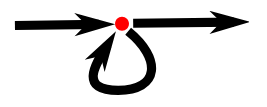

# 🚀 Looping Control Flow in JavaScript

Welcome to the world of **JavaScript loops**! Loops make repetitive tasks simple by allowing you to execute code multiple times with minimal effort. In this guide, we’ll explore **`while`** and **`do`** loops, which help manage repetition effectively.

## 📖 Table of Contents

1. [📚 Introduction to Loops](#-introduction-to-loops)
2. [🔄 Using the `while` Loop](#-using-the-while-loop)
3. [💪 Practical Example: Calculating Powers](#-practical-example-calculating-powers)
4. [🔂 Understanding the `do` Loop](#-understanding-the-do-loop)
5. [📌 Key Takeaways](#-key-takeaways)

## 📚 Introduction to Loops

Imagine needing to print all even numbers from 0 to 12. Writing out every line manually would look like this:

```javascript
console.log(0);
console.log(2);
console.log(4);
console.log(6);
console.log(8);
console.log(10);
console.log(12);
```

This approach works for small tasks, but imagine printing all even numbers up to 1,000—typing each one would be exhausting! Here’s where **loops** come in handy, allowing you to handle repetitive tasks with minimal code.

<div style="text-align: center;">
    
</div>

## 🔄 Using the `while` Loop

A `while` loop lets you repeat code as long as a specific condition is met. Let’s use it to print even numbers from 0 to 12 in a more efficient way.

### Example: Printing Even Numbers

```javascript
let number = 0;
while (number <= 12) {
  console.log(number);
  number = number + 2;
}
// Output:
// 0
// 2
// … etcetera
```

### Explanation:

- **Loop Initialization**: `let number = 0` sets the starting point.
- **Condition Check**: The loop continues while `number <= 12`.
- **Increment**: After each iteration, `number` increases by 2, progressing towards 12.

**How it Works**: Each time the loop runs, it checks `number <= 12`. If `true`, it executes the code block. When `number` becomes greater than 12, the loop stops.

## 💪 Practical Example: Calculating Powers

Let’s calculate \(2^{10}\) using a `while` loop to illustrate how loops manage repetitive calculations.

```javascript
let result = 1;
let counter = 0;
while (counter < 10) {
  result = result * 2;
  counter = counter + 1;
}
console.log(result);  // Output: 1024
```

### Explanation:

- **`result`**: Starts at 1 and doubles each iteration.
- **`counter`**: Tracks how many times `result` is multiplied.
- **Loop Condition**: The loop stops once `counter` reaches 10.

Using the loop, we calculate \(2^{10} = 1024\) by doubling the `result` variable 10 times.

> **Note**: JavaScript has an exponentiation operator (`2 ** 10`) for quick calculations. Here, we’re using a loop for learning purposes!

## 🔂 Understanding the `do` Loop

A `do` loop is similar to a `while` loop but **guarantees at least one execution** of the loop body. The loop condition is evaluated after the first run, making it ideal for scenarios where the code must run at least once.

### Example: Prompting for a Name

```javascript
let yourName;
do {
  yourName = prompt("Who are you?");
} while (!yourName);
console.log("Hello " + yourName);
```

### Explanation:

- **Loop Initialization**: Prompts for your name and assigns it to `yourName`.
- **Condition Check**: The loop repeats until `yourName` is not an empty string.
- **Boolean Conversion**: Using `!` converts strings to `true` or `false`. An empty string is `false`, so `!yourName` is `true` until a name is provided.

This example ensures that the prompt continues until the user enters a non-empty string.

## 📌 Key Takeaways

- **Efficient Repetition**: Loops simplify repetitive tasks in code.
- **`while` Loops**: Execute the code block as long as the condition is `true`.
- **`do` Loops**: Run the code block once before checking the condition, guaranteeing at least one execution.
