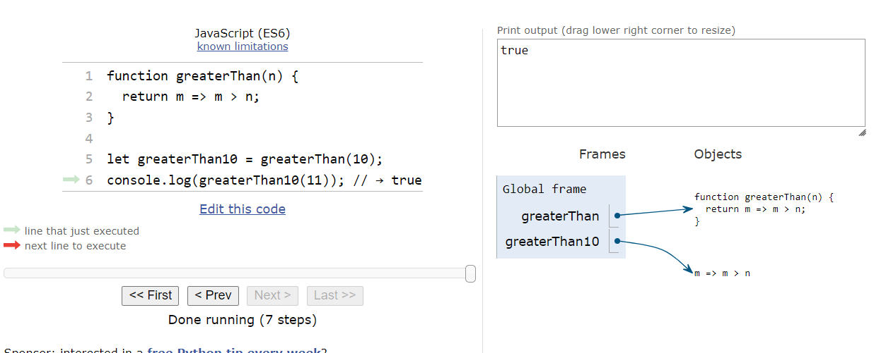
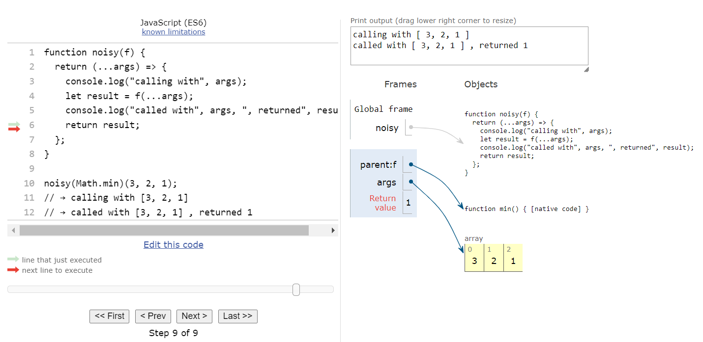

# Higher-Order Functions

## Introduction
Higher-order functions are functions that work with other functions. They can take functions as arguments or return them. This helps us simplify and organize our code by abstracting actions, not just values.

## Creating New Functions

### Example
Here's an example of a function that creates another function:

```javascript
function greaterThan(n) {
  return m => m > n;
}

let greaterThan10 = greaterThan(10);
console.log(greaterThan10(11)); // → true
```



The `greaterThan` function takes a number `n` and returns a new function. This new function checks if another number `m` is greater than `n`.

## Changing Other Functions

### Example
Here's an example of a function that changes another function:

```javascript
function noisy(f) {
  return (...args) => {
    console.log("calling with", args);
    let result = f(...args);
    console.log("called with", args, ", returned", result);
    return result;
  };
}

noisy(Math.min)(3, 2, 1);
// → calling with [3, 2, 1]
// → called with [3, 2, 1] , returned 1
```



The `noisy` function takes another function `f` and returns a new function. The new function logs the arguments it was called with, calls `f`, logs the result, and then returns the result.

## New Types of Control Flow

### Example
Here's an example of a function that provides new types of control flow:

```javascript
function unless(test, then) {
  if (!test) then();
}

function repeat(n, action) {
  for (let i = 0; i < n; i++) {
    action(i);
  }
}

repeat(3, n => {
  unless(n % 2 === 1, () => {
    console.log(n, "is even");
  });
});
// → 0 is even
// → 2 is even
```

In this example:

- `unless` is a function that takes a condition (`test`) and another function (`then`). If the condition is false, it calls the `then` function.
- `repeat` is a function that takes a number `n` and an action. It repeats the action `n` times.
- We use `unless` within `repeat` to log even numbers. If `n` is even (`n % 2 === 0`), it logs that `n` is even.

## Built-in Array Method: forEach

### Example
JavaScript arrays have a built-in method `forEach` that acts as a higher-order function, similar to a `for/of` loop:

```javascript
["A", "B"].forEach(l => console.log(l));
// → A
// → B
```

The `forEach` method takes a function and calls it for each element in the array.

