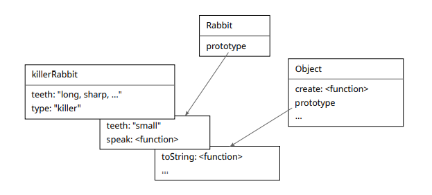

# Overriding Derived Properties

## Introduction
When you add a property to an object, it will be added to the object itself, even if that property is already present in the prototype. This means the object's own property will hide the property in the prototype.

## Example of Overriding Properties

### Initial Setup
Consider the following example where we have a `Rabbit` class and create an instance called `killerRabbit`.

```javascript
class Rabbit {
    constructor(type) {
        this.type = type;
    }
}

Rabbit.prototype.teeth = "small";

let killerRabbit = new Rabbit("killer");
console.log(killerRabbit.teeth); // small
```

### Overriding the Property
Now, we add a `teeth` property to the `killerRabbit` instance.

```javascript
killerRabbit.teeth = "long, sharp, and bloody";
console.log(killerRabbit.teeth); // long, sharp, and bloody
```

### Explanation
- **Prototype Property**: `Rabbit.prototype.teeth` is "small".
- **Instance Property**: `killerRabbit.teeth` is initially "small" (inherited from the prototype).
- **Override**: When we set `killerRabbit.teeth` to "long, sharp, and bloody", it overrides the prototype property.

### Checking Other Instances and the Prototype
```javascript
console.log((new Rabbit("basic")).teeth); // small
console.log(Rabbit.prototype.teeth); // small
```

### Explanation
- **New Instance**: A new `Rabbit` instance still has `teeth` as "small".
- **Prototype**: The prototype's `teeth` property remains "small".

## Diagram Explanation
The diagram illustrates the following points:

1. **Prototype Chain**: `killerRabbit` inherits properties from `Rabbit.prototype` and `Object.prototype`.
2. **Overridden Property**: `killerRabbit.teeth` overrides `Rabbit.prototype.teeth`.



- **Killer Rabbit**: Has its own `teeth` property ("long, sharp, ...") and the `type` property ("killer").
- **Rabbit Prototype**: Has `teeth` ("small") and `speak` method.
- **Object Prototype**: Has `create` method and `toString` method.

## Practical Use of Overriding Properties

### Expressing Exceptional Properties
Overriding is useful to express special properties for specific instances while keeping a standard value for others.

### Example with Arrays and Objects
```javascript
console.log(Array.prototype.toString == Object.prototype.toString); // false
console.log([1, 2].toString()); // 1,2
console.log(Object.prototype.toString.call([1, 2])); // [object Array]
```

### Explanation
- **Array `toString`**: Converts array elements to a string separated by commas.
- **Object `toString`**: For arrays, it shows "[object Array]" since it doesn't know about array specifics.

## Summary

1. **Overriding Properties**: Adding a property to an object hides the same property in the prototype.
2. **Prototype Chain**: Objects inherit properties from their prototypes.
3. **Practical Use**: Overriding can express unique properties for specific instances while keeping standard values in the prototype.

### Key Points
- **Object Properties**: Direct properties override prototype properties.
- **Prototype Inheritance**: Useful for shared properties and methods.
- **Special Cases**: Overriding allows exceptions while maintaining general behavior.
