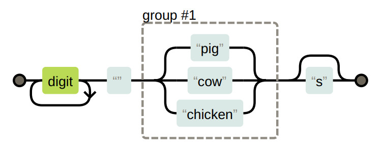

# Mechanics of Matching in Regular Expressions 🔍

When using regular expressions in JavaScript, the **engine** (the program that processes the regex) looks for a match in your string step-by-step. It starts from the **beginning** of the string and checks for a match. If it doesn’t find one, it moves to the **next character** and continues until it finds a match or reaches the **end** of the string. This process is conceptually like following a **flow diagram** to see if the pattern matches. Let's break this down with simple explanations and real-world examples! 🌟

## How Regex Matching Works 🚦

When you use methods like `exec()` or `test()`, the **regular expression engine** performs these steps:

1. **Start from the Beginning of the String** 🏁: The engine starts from the first character of the string and tries to match the pattern.
2. **Move to the Next Character if No Match is Found** ➡️: If the pattern does not match from the current position, the engine moves to the next character and tries again.
3. **Repeat Until a Match is Found or End of String** 🔄: This continues until a match is found, or the engine reaches the end of the string.

If it finds a match, it returns that match. If not, it returns **null** or **false**, indicating no match.

## Understanding the Flow Diagram for Regex 🧩

<div style="text-align: center;">
    
</div>

The image represents a **flow diagram** for the regular expression `\d+ (pig|cow|chicken)s?`. The diagram visually explains how the regex engine processes the pattern to find a match:

1. **Digit (`\d+`)**: Matches **one or more digits**. This part looks for the **number** of animals.
2. **Space (`" "`)**: Matches a **single space** after the number.
3. **Group #1 (`(pig|cow|chicken)`)**: This is a **choice group** where the engine can match **either "pig", "cow", or "chicken"**.  
   - The engine checks for **"pig"** first. If it matches, it moves to the next step.
   - If **"pig"** doesn’t match, it tries **"cow"**.  
   - If **"cow"** doesn’t match, it tries **"chicken"**.
4. **Optional "s" (`s?`)**: Matches **zero or one "s"**, allowing for **both singular ("pig") and plural ("pigs")** forms.

The goal is to find a **path from the start to the end** of the diagram, meaning the expression successfully matches the text!

## Real-World Example: Counting Farm Animals 🐄🐔🐖

Imagine you're developing a farm management app, and you want to find out how many pigs, cows, or chickens are mentioned in a user's input. Here’s how the regex would work step-by-step:

### Example Code 🧑‍💻

```javascript
let animalCount = /\d+ (pig|cow|chicken)s?/; // Pattern to match a number followed by one of the animals

console.log(animalCount.test("15 pigs")); // ✅ True - Matches "15 pigs"
console.log(animalCount.test("3 cow")); // ✅ True - Matches "3 cow"
console.log(animalCount.test("12 chickens")); // ✅ True - Matches "12 chickens"
console.log(animalCount.test("15 pugs")); // ❌ False - "pugs" is not one of the specified animals
```

## Step-by-Step Explanation of "15 pigs" 🐷

1. **Start from the Beginning** 🏁: The engine starts at the first character, "1".
2. **Match Digits (`\d+`)** 🔢: It finds "15" (digits), which matches **`\d+`**.
3. **Match Space (`" "`)** 🕳️: After "15", it finds a space, which matches the space pattern.
4. **Match One of the Choices (`(pig|cow|chicken)`)** 🐖🐄🐔: It then tries to match one of the choices:
   - **"pig"**: The string has "pigs", so "pig" matches.
5. **Match Optional "s" (`s?`)** ✅: Finally, it checks for "s". Since "pigs" has an "s", it matches, completing the pattern.

Since the engine finds a valid path from start to end in the flow diagram, it returns **true**.
