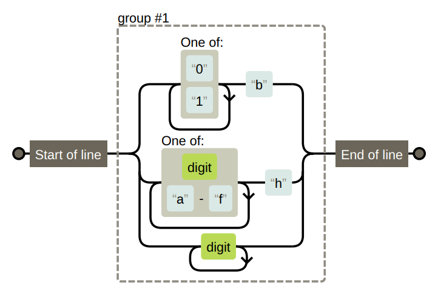
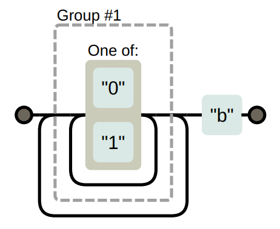

# Understanding Backtracking 🔄

When working with **regular expressions** (regex), backtracking is an essential concept that allows the regex engine to handle complex patterns efficiently. However, it can also lead to performance issues if not used carefully. Let's break down the idea of **backtracking** with simple explanations and practical real-world examples! 🌟

---

## 📚 Table of Contents

1. [What is Backtracking in Regex? 🤔](#what-is-backtracking-in-regex-)
2. [How Does Backtracking Work? 🔄](#how-does-backtracking-work-)
3. [Example Regex Pattern: Matching Binary, Hexadecimal, and Decimal Numbers 🔢](#example-regex-pattern-matching-binary-hexadecimal-and-decimal-numbers-)
   - [Flow Diagram 1: Matching Binary, Hexadecimal, or Decimal Numbers 🔢](#flow-diagram-1-matching-binary-hexadecimal-or-decimal-numbers-)
4. [Real-World Example: Validating Different Number Systems 📊](#real-world-example-validating-different-number-systems-)
5. [Backtracking with Repetition Operators `+` and `*` ♻️](#backtracking-with-repetition-operators--and--)
   - [Example Code: Matching Strings with Repetition Operators](#example-code-matching-strings-with-repetition-operators)
6. [When Backtracking Goes Wrong: The Performance Pitfall 🐌](#when-backtracking-goes-wrong-the-performance-pitfall-)
   - [Problematic Code Example 🧩](#problematic-code-example-🧩)
   - [Flow Diagram 2: Matching a Binary Pattern with Nested Repetition 🔄](#flow-diagram-2-matching-a-binary-pattern-with-nested-repetition-)
7. [📑 Summary ✨](#-summary-)
8. [🚀 Conclusion 🚀](#-conclusion-)
9. [📬 Stay Connected 📬](#-stay-connected-)

---

## What is Backtracking in Regex? 🤔

**Backtracking** occurs when a regex engine tries to match a pattern but realizes partway through that the current path won't work. It then "backtracks" (or goes back) to the previous decision point to try a different path. This happens often in regex patterns that have **alternatives** (choices) or **repetitions**.

### How Does Backtracking Work? 🔄

1. **Start Matching from the Beginning** 🏁: The regex engine starts matching the pattern from the beginning of the string.
2. **Choose a Path** ➡️: If there are multiple possible paths (like choices or repetitions), the engine chooses the first one.
3. **Backtrack if the Current Path Fails** 🔄: If the engine realizes that the chosen path doesn't lead to a full match, it backtracks to the last decision point and tries another path.
4. **Repeat Until a Match is Found or All Options are Exhausted** 🔄: This process continues until a match is found or no more options are left.

If it finds a match, it returns that match. If not, it returns **null** or **false**, indicating no match.

---

## Example Regex Pattern: Matching Binary, Hexadecimal, and Decimal Numbers 🔢

Consider the regex `/^([01]+b|[\da-f]+h|\d+)$/`. This pattern matches:

1. **Binary numbers** followed by a "b" (e.g., `1010b`).
2. **Hexadecimal numbers** (base 16, including digits and letters a to f) followed by an "h" (e.g., `3a9h`).
3. **Decimal numbers** with no suffix (e.g., `103`).

### Flow Diagram 1: Matching Binary, Hexadecimal, or Decimal Numbers 🔢

<div style="text-align: center;">
    
</div>

The first flow diagram corresponds to the regex pattern:

```regex
/^([01]+b|[\da-f]+h|\d+)$/
```

This pattern is designed to match **binary**, **hexadecimal**, or **decimal** numbers. Let’s break down the diagram step-by-step:

#### Components of the Flow Diagram 🧩

1. **Start of Line (`^`)** 🚦  
   The diagram starts at the "Start of line" box, represented by the `^` anchor in regex. This anchor ensures that the pattern must match **from the beginning** of the string.

2. **Group #1: Choice between Patterns (`|`)** 🎯  
   The next part is a **group** (`(...)`) that contains three options separated by the pipe (`|`) character. The group will try to match **one** of these three options:
   
   - **Option 1: Binary Pattern (`[01]+b`)**  
     - Matches **one or more** (`+`) occurrences of the digits **0** or **1** followed by a `b`.
     - The **"One of:"** box shows that the engine can choose either `"0"` or `"1"` and repeat them.
     - After matching these digits, the engine looks for the `"b"` character.
  
   - **Option 2: Hexadecimal Pattern (`[\da-f]+h`)**  
     - Matches **one or more** (`+`) occurrences of any digit (`\d`) or letters from **a to f** followed by an `h`.
     - The **"One of:"** box shows the engine can choose a digit (`0-9`) or a letter (`a-f`).
     - After matching these characters, it checks for `"h"`.
  
   - **Option 3: Decimal Pattern (`\d+`)**  
     - Matches **one or more** (`+`) occurrences of any digit (`\d`).
     - No suffix character is needed after the digits in this case.

3. **End of Line (`$`)** 🛑  
   The last part of the diagram is the "End of line" box, represented by the `$` anchor in regex. This anchor ensures that the pattern must match **until the end** of the string.

#### How the Regex Engine Follows the Flow Diagram 🔄

For an input like `"1010b"`:

- **Step 1:** The engine starts at the **start of line** anchor (`^`).
- **Step 2:** It enters **Group #1** and tries the **first option** (`[01]+b`).
  - It matches `"1010"` (digits `0` and `1`), and then it matches `"b"`.
- **Step 3:** It reaches the **end of line** (`$`), and since the entire input matches the pattern, it reports a successful match. ✅

For an input like `"103"`:

- **Step 1:** The engine starts at the **start of line** (`^`).
- **Step 2:** It enters **Group #1** and tries the **first option** (`[01]+b`).
  - It matches `"10"` but fails to match `"3"` because `3` is not a valid binary digit. The engine **backtracks**.
- **Step 3:** It tries the **second option** (`[\da-f]+h`).
  - It matches `"103"` but fails to match `"h"`. The engine **backtracks** again.
- **Step 4:** It tries the **third option** (`\d+`) and matches `"103"` successfully. It reaches the **end of line** and reports a match. ✅

---

## Real-World Example: Validating Different Number Systems 📊

Suppose you are building a calculator app that supports different number systems. You want to ensure that the user inputs are valid binary, hexadecimal, or decimal numbers.

### Example Code 🧑‍💻

```javascript
const numberPattern = /^([01]+b|[\da-f]+h|\d+)$/;

console.log(numberPattern.test("1010b")); // ✅ True - Matches binary number
console.log(numberPattern.test("3a9h")); // ✅ True - Matches hexadecimal number
console.log(numberPattern.test("103")); // ✅ True - Matches decimal number
console.log(numberPattern.test("103b")); // ❌ False - Invalid binary format
```

📝 **Explanation:**

- **Binary Branch (`[01]+b`)**: Matches one or more `0` or `1` followed by a `b`.
- **Hexadecimal Branch (`[\da-f]+h`)**: Matches digits or letters `a` to `f` followed by an `h`.
- **Decimal Branch (`\d+`)**: Matches one or more digits.

*When matching `"103"`, the engine first tries the **binary branch**. It matches `1` and `0`, but fails at `3` since `3` is not a valid binary digit. The engine **backtracks** and tries the **hexadecimal branch**, but it fails again because there's no `h`. Finally, it tries the **decimal branch**, which matches successfully.*

---

## Backtracking with Repetition Operators `+` and `*` ♻️

Backtracking also happens with repetition operators like `+` and `*`, which match **one or more** (`+`) or **zero or more** (`*`) occurrences of a pattern. 

### Example Code: Matching Strings with Repetition Operators

```javascript
const pattern = /^.*x/;

console.log(pattern.test("abcxe")); // ✅ True - Matches from "abcx"
console.log(pattern.test("abc")); // ❌ False - No "x" in the string
```

📝 **Explanation:**

- **`.*`**: Matches **zero or more** of any character.
- **`x`**: Looks for the character "x".

*For the input `"abcxe"`, the engine tries to match `.*` as much as possible. It initially consumes the entire string `"abcxe"`. However, it doesn’t find an "x" at the end, so it **backtracks** step by step until it finds `"x"` at `"abcx"`.*

---

## When Backtracking Goes Wrong: The Performance Pitfall 🐌

Backtracking can become a problem when there are **nested repetitions** or **ambiguous patterns**. For example, the regex `/([01]+)+b/` tries to match binary numbers followed by a `b`. If there is no trailing `b`, it will backtrack extensively, trying every possible way to match:

### Problematic Code Example 🧩

```javascript
const problematicPattern = /([01]+)+b/;

console.log(problematicPattern.test("000000000000000000")); // ❌ Extremely slow - Backtracking overload
```

<div style="text-align: center;">
    
</div>

### Flow Diagram 2: Matching a Binary Pattern with Nested Repetition 🔄

The second flow diagram corresponds to the problematic regex pattern:

```regex
/([01]+)+b/
```

This pattern tries to match **binary numbers** followed by a `b`, but it has **nested repetitions** that can cause extensive backtracking.

#### Components of the Flow Diagram 🧩

1. **Start of Line** 🚦  
   As with the first diagram, the matching begins at the start of the line.

2. **Group #1: Nested Repetition of Binary Digits (`([01]+)+`)** ♻️  
   - The **outer repetition** (`(...)`) matches **one or more** (`+`) occurrences of a **group**.
   - Inside this group is another repetition (`[01]+`) that matches **one or more** (`+`) occurrences of **0** or **1**.
   - This creates a **nested loop** situation where the regex engine can match the same binary digits in multiple ways.

3. **Literal "b"** 🔠  
   - After matching the binary digits, the engine expects to find the literal character `"b"`.

#### How the Regex Engine Follows the Flow Diagram 🔄

For an input like `"000000000000000000"`:

- **Step 1:** The engine starts at the **start of line**.
- **Step 2:** It enters **Group #1** and tries to match as many **0s and 1s** as possible using the inner repetition (`[01]+`).
- **Step 3:** It reaches the end of the string without finding `"b"`, so it **backtracks**:
  - It reduces the length of the match and tries again.
  - This process repeats multiple times because of the **nested repetition**, leading to excessive backtracking.

*This excessive backtracking can cause significant performance issues, especially with long strings and complex patterns.*

---

## 📑 Summary ✨

- **Backtracking** is a technique used by regex engines to try different paths when matching a pattern.
- It’s helpful for handling **choices** and **repetitions** but can lead to performance problems if not used carefully.
- **Real-world uses** include validating user input for different formats and ensuring patterns match complex strings.

---

## 🚀 Conclusion 🚀

Understanding **backtracking** in regular expressions significantly enhances your ability to craft precise and efficient patterns in JavaScript. While backtracking is a powerful tool that allows regex engines to handle complex patterns by exploring multiple matching paths, it can also lead to performance issues, especially with patterns that involve **nested repetitions** or **ambiguous alternatives**. By being mindful of how your regex patterns are structured and avoiding unnecessary complexity, you can leverage backtracking effectively without compromising performance.

**🌟 Key Takeaways:**

- **Backtracking Mechanics**:
  - The regex engine starts matching from the beginning and moves character by character.
  - When faced with multiple paths (choices or repetitions), it explores each one sequentially.
  - Excessive backtracking can occur with **nested repetitions** or **ambiguous patterns**, leading to performance degradation.
  
- **Pattern Design**:
  - **Avoid Nested Repetitions**: Patterns like `/([01]+)+b/` can cause excessive backtracking.
  - **Be Specific**: The more specific your patterns are, the less backtracking the engine needs to perform.
  - **Use Atomic Groups**: Techniques like atomic grouping or possessive quantifiers (in regex flavors that support them) can prevent unnecessary backtracking.
  
- **Practical Applications**:
  - **Input Validation**: Ensuring user inputs match specific formats efficiently.
  - **Data Extraction**: Parsing complex strings without incurring performance penalties.
  - **Performance Optimization**: Writing regex patterns that minimize backtracking to maintain application responsiveness.

By mastering the concept of backtracking and understanding how regex engines navigate patterns, you can write more efficient and effective regular expressions. This knowledge is crucial for developing applications that handle text processing tasks reliably and swiftly. Keep experimenting with different patterns and be mindful of how backtracking can impact performance to harness the full power of regular expressions in your JavaScript projects!

