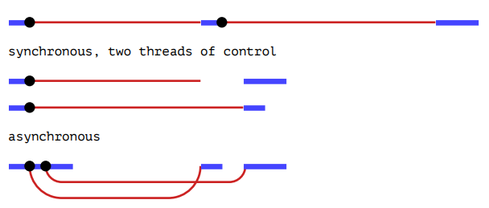

# 🚀 **Asynchronous Programming** 🌍

Welcome to the comprehensive guide on **Asynchronous Programming**! 🎉 Whether you're a beginner looking to understand the basics or a seasoned developer aiming to refine your skills, this README has got you covered. Dive in to explore the intricacies of asynchronous programming, enriched with real-world examples, vibrant emojis, and a neatly organized table of contents for easy navigation. 📚✨

---

## 📑 **Table of Contents**

1. [Introduction](#1-introduction)
2. [What is Asynchronous Programming? 🤔](#2-what-is-asynchronous-programming-)
3. [Real-World Examples](#3-real-world-examples)
    - [1. Cooking Dinner 🍳](#3.1-cooking-dinner-)
        - [Synchronous Cooking (One Thing at a Time) 🕰️](#synchronous-cooking-one-thing-at-a-time-️)
        - [Asynchronous Cooking (Multitasking) ⚡](#asynchronous-cooking-multitasking-)
    - [2. Laundry Day 🧺](#3.2-laundry-day-)
        - [Synchronous Laundry 🕰️](#synchronous-laundry-️)
        - [Asynchronous Laundry ⚡](#asynchronous-laundry-)
    - [3. Sending Emails 📧](#3.3-sending-emails-)
        - [Synchronous Email Sending 🕰️](#synchronous-email-sending-️)
        - [Asynchronous Email Sending ⚡](#asynchronous-email-sending-)
4. [Benefits of Asynchronous Programming 🎁](#4-benefits-of-asynchronous-programming-)
5. [Asynchronous Programming in Web Applications 🌐](#5-asynchronous-programming-in-web-applications-)
    - [Example: Loading Webpage Content](#5.1-example-loading-webpage-content)
    - [Practical Example: Infinite Scroll 📜](#5.2-practical-example-infinite-scroll-)
6. [Why Asynchronous Programming Matters 🧐](#6-why-asynchronous-programming-matters-)
7. [Understanding the Diagram of Synchronous vs. Asynchronous Programming 📝](#7-understanding-the-diagram-of-synchronous-vs-asynchronous-programming-)
    - [1. Synchronous, Two Threads of Control 🧵🧵](#7.1-synchronous-two-threads-of-control-️)
    - [2. Synchronous, Single Thread of Control 🧵](#7.2-synchronous-single-thread-of-control-️)
    - [3. Asynchronous 🔄](#7.3-asynchronous-)
8. [Final Thoughts 💡](#8-final-thoughts-)

---

## 1. **Introduction** 📖

**Asynchronous Programming** is a programming paradigm that allows a program to initiate a task and **proceed** to other tasks **without waiting** for the initial task to complete. This approach enhances efficiency and responsiveness, especially in applications that handle multiple operations simultaneously. Think of it as multitasking in your daily life, where you juggle various activities seamlessly. 🤹‍♂️

---

## 2. **What is Asynchronous Programming?** 🤔

Asynchronous programming enables a program to start a task and **move on** to other tasks **before** that initial task has finished. When the task completes, the program is notified and can then process the result. This is akin to multitasking in real life, allowing for better resource utilization and improved performance.

**Key Concepts:**
- **Non-blocking Operations:** The program doesn't halt execution while waiting for a task to complete.
- **Concurrency:** Multiple tasks are handled in overlapping time periods.
- **Callbacks, Promises, and `async/await`:** Common mechanisms to manage asynchronous operations in various programming languages.

---

## 3. **Real-World Examples**

Understanding asynchronous programming becomes easier when related to everyday scenarios. Let's explore some real-world examples to illustrate the difference between synchronous and asynchronous approaches.

### 3.1. **Cooking Dinner** 🍳

#### **Synchronous Cooking (One Thing at a Time) 🕰️**

Imagine you're preparing dinner and decide to handle each task **sequentially**:

1. **Boil Water for Pasta**: Start boiling water and **wait** by the stove until the water boils. 🚰➡️🔥
2. **Cook Pasta**: Once the water boils, add the pasta and **wait** until it's cooked. 🍝
3. **Prepare Sauce**: After the pasta is done, start making the sauce. 🍅
4. **Set the Table**: When the sauce is ready, set the table. 🍽️

*This process is **synchronous** because you complete one task **fully** before starting the next. It consumes more time due to the **waiting periods**.*

#### **Asynchronous Cooking (Multitasking) ⚡**

Now, let's approach cooking **asynchronously**:

1. **Boil Water for Pasta**: Start boiling water. 🚰➡️🔥
2. **Prepare Sauce While Water Boils**: While waiting for the water to boil, start making the sauce. 🍅
3. **Set the Table While Cooking**: While the pasta and sauce are cooking, set the table. 🍽️
4. **Dinner is Ready Faster**: Everything finishes around the same time. 🎉

*Here, you're **not waiting** for one task to finish before starting another. You're efficiently utilizing your time by handling tasks that can run **in parallel**.*

---

### 3.2. **Laundry Day** 🧺

#### **Synchronous Laundry 🕰️**

1. **Wash Clothes**: Put clothes in the washing machine and **wait** until the cycle is done. 🕑
2. **Dry Clothes**: Move clothes to the dryer and **wait** until they're dry. 🕑
3. **Fold Clothes**: After drying, fold the clothes. 👕

*This method takes a lot of time because you're **idle** during the wash and dry cycles.*

#### **Asynchronous Laundry ⚡**

1. **Start Washing Machine**: Load clothes and start the wash cycle. 🧺
2. **Do Other Chores While Washing**: Vacuum the house, wash dishes, etc. 🧹🍽️
3. **Transfer to Dryer**: When the wash cycle is done, move clothes to the dryer. 🧺➡️🚿
4. **Continue Other Tasks**: Continue with other activities while clothes dry.
5. **Fold Clothes**: When the dryer is done, fold the clothes. 👕

*By overlapping tasks, you make better use of your time.*

---

### 3.3. **Sending Emails** 📧

#### **Synchronous Email Sending 🕰️**

1. **Compose Email**: Write an email. ✍️
2. **Send Email and Wait**: Click send and **wait** until the email is delivered. 🕑
3. **Start Next Task**: Only after the email is sent do you move on.

*This approach causes delays as you're **waiting** for each email to send before proceeding.*

#### **Asynchronous Email Sending ⚡**

1. **Compose Email**: Write an email. ✍️
2. **Send Email**: Click send.
3. **Move On Immediately**: Start working on other tasks without waiting. 📋
4. **Email Sends in Background**: The email program sends the email while you work.

*Here, the email sends in the background, allowing you to continue with other tasks without unnecessary delays.*

---

## 4. **Benefits of Asynchronous Programming** 🎁

Embracing asynchronous programming offers several advantages:

1. **Efficiency**: Utilizes system resources optimally by avoiding idle times during wait periods.
2. **Responsiveness**: Keeps applications responsive to user inputs even while processing tasks.
3. **Parallel Operations**: Enables multiple operations to occur simultaneously, enhancing performance.
4. **Scalability**: Better handles a large number of concurrent operations, making applications more scalable.
5. **Improved User Experience**: Users experience smoother and faster interactions with applications.

---

## 5. **Asynchronous Programming in Web Applications** 🌐

Modern web applications heavily rely on asynchronous programming to deliver seamless and interactive experiences. Let's delve into how asynchronous operations enhance web functionalities.

### 5.1. **Example: Loading Webpage Content**

When you visit a contemporary website:

- **Asynchronous Requests**: The browser loads different parts of the webpage asynchronously, fetching data without blocking the entire page load.
- **User Interaction**: You can interact with the page (e.g., clicking buttons, scrolling) while content is still loading.
- **Improved Experience**: The page feels faster and more responsive, as users aren't left staring at a blank screen during content loading.

*This asynchronous behavior ensures that user interactions aren't hindered by ongoing data fetches or processing tasks.*

---

### 5.2. **Practical Example: Infinite Scroll** 📜

- **Scenario**: On social media platforms, as you scroll down, new posts load automatically.
- **Asynchronous Loading**: The app fetches new data in the background without stopping your scrolling action.
- **Seamless Experience**: You don't have to wait or click a "Load More" button to see additional content.
- **Benefit**: The code appears synchronous for easier readability and maintenance but operates asynchronously under the hood, ensuring efficient data loading and user experience.

*Infinite scroll leverages asynchronous programming to provide continuous content delivery without disrupting the user's browsing flow.*

---

## 6. **Why Asynchronous Programming Matters** 🧐

Understanding the significance of asynchronous programming is crucial for modern software development. Here's why it matters:

- **User Experience**: Users expect applications to respond instantly. Asynchronous programming ensures that apps remain responsive, enhancing overall user satisfaction.
- **Resource Utilization**: Servers and systems can handle more operations concurrently by not blocking on slow or long-running tasks.
- **Real-Time Data**: Enables applications to update data in real-time without the need for constant refreshing, essential for applications like live chats, dashboards, and streaming services.
- **Scalability**: Asynchronous systems can scale more efficiently, handling increased loads without significant performance degradation.
- **Flexibility**: Allows developers to build more flexible and modular applications, separating concerns and managing tasks more effectively.

---

## 7. **Understanding the Diagram of Synchronous vs. Asynchronous Programming** 📝

Visual aids can significantly enhance understanding. Below is a diagram that contrasts synchronous and asynchronous programming models.

  

### 7.1. **1. Synchronous, Two Threads of Control** 🧵🧵

- **Description**: Represents a synchronous model utilizing two separate threads.
- **Thread 1 (Top Line)**:
  - Starts executing and reaches a point (black dot ⚫️) where it waits for a long-running task (e.g., a network request 🌐).
  - While waiting, the thread is idle (thin red line ➖) until the task completes (blue line ➖).
- **Thread 2 (Bottom Line)**:
  - Another thread starts executing a different task.
  - It also waits (idle) for its task to complete.

**Key Points:**
- Each thread is **blocked** (waiting) while its task is in progress. 🚧
- Multiple threads run in parallel but each waits for its respective task to finish.
- This model is **resource-intensive** due to managing multiple threads. 🖥️

---

### 7.2. **2. Synchronous, Single Thread of Control** 🧵

- **Description**: Represents a synchronous model using a single thread.
- **Execution Flow**:
  - The program starts running, initiates a task (black dot ⚫️), and **waits** (thin red line ➖) for the task to finish.
  - Once completed (blue line ➖), it proceeds to the next task.
  - It waits again (thin red line ➖) until the subsequent task completes.

**Key Points:**
- The program can perform **only one task at a time**. ⏳
- Must **wait** for each task to finish before moving on. ⛔
- Results in **blocking**, where the program remains idle (doing nothing) during wait periods. 💤

---

### 7.3. **3. Asynchronous 🔄**

- **Description**: Represents an asynchronous model with a single thread.
- **Execution Flow**:
  - The program starts executing and initiates a task (black dot ⚫️).
  - Instead of waiting for it to complete, it **immediately moves on** to other work (thin red line ➖ continues).
  - When the task completes, it "returns" to the point in the program where the result is needed (shown by the red curved line connecting back to the blue lines ➰).

**Key Points:**
- The program **does not block**; it continues running and can handle multiple tasks concurrently. 🚀
- Once the task completes, it is **notified**, and the program processes the result (using **callbacks**, **promises**, or **`async/await`** in JavaScript). 📬
- This model is **more efficient** as it better utilizes system resources and keeps the program responsive. ⚡

---

## 8. **Final Thoughts** 💡

Asynchronous programming is a powerful tool that **optimizes** the use of time and system resources by eliminating unnecessary waiting periods. Just like in daily life—reading a book while waiting for laundry to finish—programs can perform multiple tasks concurrently, enhancing efficiency and user experience.
