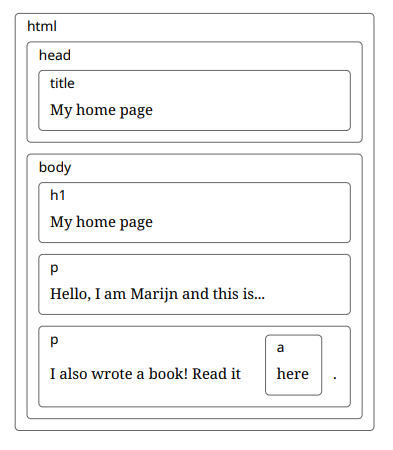

# What is an HTML Document Structure? ✨

An HTML document is like a **nested set of boxes**. These boxes represent **HTML tags**, and each box can contain **text** or **other tags** inside it. The structure shown in the image gives a visual representation of how HTML tags are organized inside each other.

<div style="text-align: center;">
  
</div>

## Here's a breakdown of the structure:

1. **html** (The Outer Box) 🏠:
   - This is the root element of the document. It contains everything inside it, including the head and body sections.

2. **head** (The First Section) 🧠:
   - The head contains **meta-information** about the document, such as the title.
   - Inside the head, there is a tag:
     - **title**: This defines the title of the webpage, which appears in the browser's tab. In this case, it’s "My home page."

3. **body** (The Main Content) 📝:
   - The body contains the **content** that is visible on the web page.
   - Inside the body, we have:
     - **h1** (Heading 1): Displays the main heading of the page. Here, it says "My home page."
     - **p** (Paragraph 1): A paragraph of text. It says, "Hello, I am Marijn and this is my home page."
     - **p** (Paragraph 2): Another paragraph with a link inside it. It says, "I also wrote a book! Read it," and the word **"here"** is clickable. It links to the URL `http://eloquentjavascript.net`.

## What is the DOM (Document Object Model)? 🌳

The **DOM** is the **representation** of this HTML structure inside the browser. Each of these "boxes" in the structure becomes an object in the DOM. For example:
- The `<html>` tag is represented by the **documentElement** object.
- The **head** and **body** tags are available as properties (`document.head` and `document.body`).

## Example of How You Can Use the DOM:
JavaScript can interact with this structure to **read** or **modify** the elements of the webpage. For example:

```javascript
// Access the document title
console.log(document.title);  // Output: "My home page"

// Change the heading text
document.querySelector("h1").textContent = "Welcome to My Page!";
```

In this example:
- **`document.title`** gives you access to the title of the page.
- **`document.querySelector("h1")`** allows you to select the `<h1>` element and change its text content.

## In Summary:
- An HTML document is like a set of nested boxes (tags) inside each other.
- The **Document Object Model (DOM)** is the browser’s way of representing and interacting with these boxes (tags) as objects.
- The DOM lets you use JavaScript to **access**, **modify**, or **add** elements to the page dynamically.
