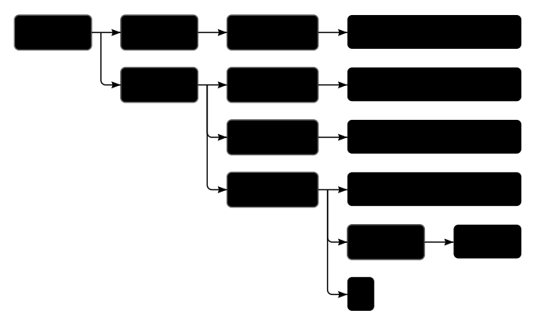

# What is a Tree Structure? 🌳

A **tree structure** is a way of organizing data where each item (called a **node**) can have other items **underneath it** (called **children**). This structure has a **hierarchy**, with a **root node** at the top, and it branches out to its child nodes, which can themselves have their own child nodes. 

In a tree:
- **Root**: The top-most node (like the `<html>` tag in HTML).
- **Parent**: A node that has one or more children.
- **Child**: A node that is contained within another node.
- **Leaf**: A node that has no children (like text or images in HTML).

<div style="text-align: center;">
  
</div>

## How the DOM Uses a Tree Structure 🌐

The **Document Object Model (DOM)** represents the structure of an HTML document as a **tree**. Each HTML tag (like `<html>`, `<body>`, `<p>`) is a **node** in the DOM tree.

### Example:

Take this simple HTML code:
```html
<html>
  <head>
    <title>My home page</title>
  </head>
  <body>
    <h1>My home page</h1>
    <p>Hello, I am Marijn and this is my home page.</p>
    <p>I also wrote a book! Read it <a href="http://example.com">here</a>.</p>
  </body>
</html>
```

In the DOM, this would look like a **tree**:

1. **Root**: `<html>` (the starting point, or the root of the tree).
2. **Children of `<html>`**: 
   - `<head>`: Contains meta-information, like the title.
   - `<body>`: Contains the content visible to users.
3. **Children of `<body>`**:
   - `<h1>`: Represents a heading.
   - `<p>`: A paragraph of text.
   - `<a>`: A link inside the second paragraph.

Each of these **elements** is a **node** in the DOM tree, and they are linked in a **parent-child** relationship. 

---

## Node Types in the DOM 🧱

In the DOM tree, different kinds of nodes represent different parts of an HTML document. For example:
- **Element Nodes**: These are tags like `<h1>`, `<p>`, `<a>`. They are the **building blocks** of the page.
  - They have a **nodeType** value of `1`.
- **Text Nodes**: These are the actual text inside the tags, like the content of a paragraph or a heading.
  - They have a **nodeType** value of `3`.
- **Comment Nodes**: These are comments in the HTML code that are not visible to users.
  - They have a **nodeType** value of `8`.

## Why Trees Are Important 🌲

**Tree structures** are not only useful for organizing HTML documents but are also widely used in other areas of computer science:
- They help in organizing and **retrieving data** efficiently.
- They allow you to **navigate** (move up and down) through a hierarchy, like selecting and modifying elements on a webpage.

---

## Example: Visualizing the Tree

If we use the HTML document example above, the DOM tree would look something like this:

```
html
├── head
│   └── title: "My home page"
└── body
    ├── h1: "My home page"
    ├── p: "Hello, I am Marijn and this is my home page."
    └── p: "I also wrote a book! Read it "
        └── a: "here" (link to http://example.com)
```

Each **node** (like `<html>`, `<head>`, `<p>`) can have **children** (other nodes), and each of these nodes can be **accessed** or **modified** using JavaScript.


