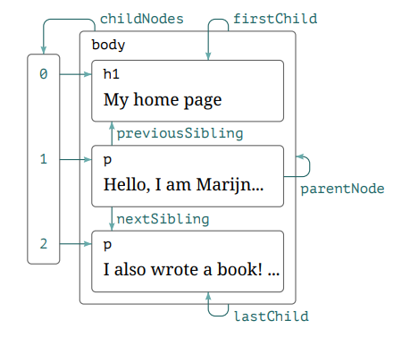

# 🌳 **Navigating the DOM Tree in JavaScript**

The **Document Object Model (DOM)** represents the structure of a webpage as a **tree of nodes**. These nodes include elements (like `<div>` and `<p>`), text, and even comments. JavaScript allows you to **navigate** through this tree using various properties. In this guide, we’ll explore how to move up, down, and sideways through the DOM tree using key properties like `parentNode`, `childNodes`, `firstChild`, `lastChild`, and more.

<div style="text-align: center;">
  
</div>

## **Understanding DOM Tree Navigation** 🔍

Here’s a simple HTML example that we’ll use to demonstrate DOM navigation:

### **HTML Example**:

```html
<!DOCTYPE html>
<html>
  <head>
    <title>DOM Navigation Example</title>
  </head>
  <body>
    <h1>My home page</h1>
    <p>Hello, I am Marijn and this is my home page.</p>
    <p>I also wrote a book! Read it <a href="http://example.com">here</a>.</p>
  </body>
</html>
```

This document contains:
- A `<h1>` heading.
- Two `<p>` paragraphs.
- A link (`<a>`) inside the second paragraph.

Now, let’s use JavaScript to **move through this structure**.

## **Key DOM Properties** 🌟

### 1. **`parentNode`**: Moving Up the Tree ⬆️
The `parentNode` property points to the **parent** of a given node.

### **Example**:

```javascript
let heading = document.querySelector("h1");
console.log(heading.parentNode); // Logs the <body> element, which is the parent of <h1>
```

In this example, the **parent** of the `<h1>` element is the `<body>` element.

### 2. **`childNodes`**: Accessing All Child Nodes ⬇️

The `childNodes` property returns an **array-like list** of all child nodes (including elements, text nodes, and comments).

### **Example**:

```javascript
let body = document.querySelector("body");
console.log(body.childNodes); // Logs NodeList of child nodes: [h1, text, p, text, p]
```

Here, you can see that **`childNodes`** returns a list of all nodes inside the `<body>`, including text nodes (spaces or line breaks).

### 3. **`firstChild` and `lastChild`**: Accessing the First and Last Child 🌱🍂

- **`firstChild`** returns the **first child** of an element.
- **`lastChild`** returns the **last child** of an element.

### **Example**:

```javascript
let firstChild = body.firstChild;
let lastChild = body.lastChild;
console.log(firstChild); // Logs the first child (might be a text node)
console.log(lastChild);  // Logs the last child (the second <p> element)
```

In many cases, the first child might be a **text node** (such as a space or line break), while the last child is often the last visible element.

### 4. **`nextSibling` and `previousSibling`**: Moving Between Siblings ↔️

- **`nextSibling`** allows you to move to the **next node** that has the same parent.
- **`previousSibling`** allows you to move to the **previous node** that has the same parent.

### **Example**:

```javascript
let firstParagraph = document.querySelector("p");
let next = firstParagraph.nextSibling; // Move to the next sibling
let previous = firstParagraph.previousSibling; // Move to the previous sibling
console.log(next); // Logs the second <p> tag
console.log(previous); // Might log a text node or space (depending on the formatting)
```

Using `nextSibling` and `previousSibling`, you can traverse through elements that are on the **same level** in the DOM.

### 5. **`children`**: Accessing Only Element Children 🌿

The `children` property is similar to `childNodes`, but it only returns **element nodes**, ignoring text nodes or comments.

### **Example**:

```javascript
console.log(body.children); // Logs HTMLCollection of elements: [h1, p, p]
```

This method is useful when you don’t care about text nodes or comments and only want to work with **HTML elements**.

## **Complete Code Example** 🎯

Here’s a full example where we combine these properties to navigate and manipulate the DOM dynamically:

```html
<!DOCTYPE html>
<html>
  <head>
    <title>DOM Navigation Example</title>
    <style>
      .highlight { background-color: yellow; }
    </style>
  </head>
  <body>
    <h1>My home page</h1>
    <p>Hello, I am Marijn and this is my home page.</p>
    <p>I also wrote a book! Read it <a href="http://example.com">here</a>.</p>

    <script>
      // Select the first paragraph and get its parent (body)
      let firstParagraph = document.querySelector("p");
      let parent = firstParagraph.parentNode;
      console.log("Parent of first paragraph:", parent); // Logs the <body> element

      // Get all child nodes of the body
      let body = document.querySelector("body");
      console.log("All child nodes of body:", body.childNodes); // Logs all child nodes

      // Access the first and last child of the body
      console.log("First child of body:", body.firstChild); // Might be a text node
      console.log("Last child of body:", body.lastChild);  // Logs the second <p> element

      // Move to the next and previous siblings of the first paragraph
      let nextSibling = firstParagraph.nextSibling;
      let previousSibling = firstParagraph.previousSibling;
      console.log("Next sibling of first paragraph:", nextSibling); // Might be a text node or another element
      console.log("Previous sibling of first paragraph:", previousSibling); // Logs a text node or space

      // Get only element children of the body
      console.log("Element children of body:", body.children); // Logs <h1> and both <p> elements

      // Highlight the last paragraph by adding a class
      let lastParagraph = document.querySelector("body").lastChild;
      if (lastParagraph.nodeType === Node.ELEMENT_NODE) {
        lastParagraph.classList.add("highlight");  // Adds yellow background to the last paragraph
      }
    </script>
  </body>
</html>
```

### **What’s Happening**:

- **Navigation**: We use properties like `parentNode`, `childNodes`, `firstChild`, `lastChild`, `nextSibling`, and `previousSibling` to move around the DOM.
- **Manipulation**: We highlight the last paragraph by adding a class using `classList.add("highlight")`.
